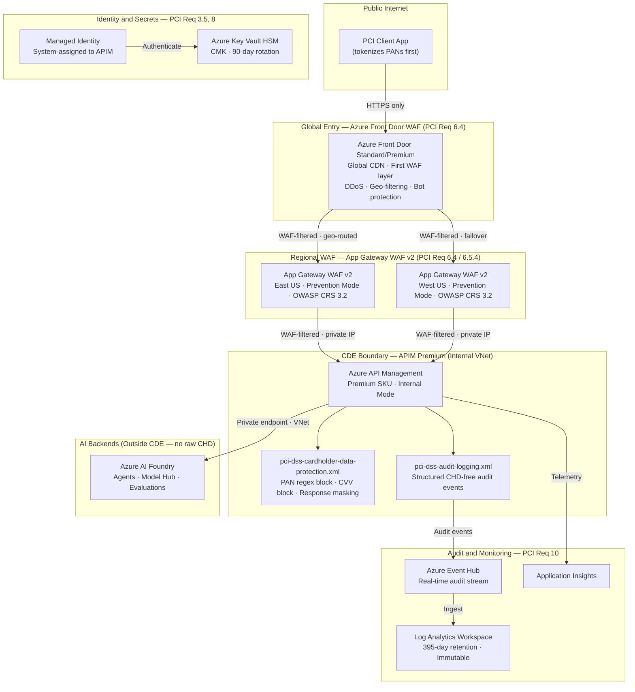

# PCI DSS v4.0 Compliance

This document covers every Azure service required to operate AI Foundry models and agents in a PCI DSS v4.0 compliant configuration.

> **Architecture pattern — Tokenize-then-infer.** Callers must tokenize raw PANs in a PCI-scoped vault **before** calling APIM. AI model backends (Foundry, OpenAI) are outside the Cardholder Data Environment (CDE) and must never receive raw cardholder data.

## Architecture Overview

## Required Services

### 1. Azure API Management (Premium SKU)

| Attribute | Value |
|---|---|
| **SKU** | Premium — required for Internal VNet mode |
| **VNet Mode** | Internal — APIM has no public inbound interface |
| **TLS** | 1.2 minimum; TLS 1.0/1.1/SSL 3.0 disabled via `customProperties` |
| **Encryption** | Customer-managed key (CMK) from Key Vault HSM |
| **Identity** | System-assigned managed identity (no stored credentials) |
| **PCI Policies** | `pci-dss-cardholder-data-protection.xml`, `pci-dss-audit-logging.xml` |
| **PCI Product** | `ai-gold` — approval required, 1 subscription per consumer (Req 7) |
| **PCI Requirements** | Req 1.3, 3.4, 3.5, 4.2.1, 6.4, 7, 8, 10 |

> ⚠️ `semantic-caching.xml` and body-logging policies **must not** be applied to PCI-scoped operations.

### 2. Azure AI Foundry

| Attribute | Value |
|---|---|
| **Network** | Private endpoint only; `publicNetworkAccess: Disabled` |
| **Auth** | APIM managed identity; no API keys distributed |
| **Thread TTL** | Keep short (15 min) to avoid CHD persisting in agent threads |
| **Fine-tuning data** | Scan for CHD before upload |
| **PCI Requirements** | Req 3.3, 7 |

### 3. Azure Key Vault (HSM-backed)

| Attribute | Value |
|---|---|
| **Tier** | Premium — HSM-backed keys required for Req 3.5 |
| **Key Type** | RSA-HSM 4096-bit or EC-HSM P-384 |
| **Rotation** | Automatic 90-day policy |
| **Access** | Private endpoint only |
| **Auth** | APIM managed identity via `Key Vault Crypto User` RBAC role |
| **PCI Requirements** | Req 3.5, 3.7 |

### 4. Virtual Network + Network Security Groups

| Attribute | Value |
|---|---|
| **APIM Subnet** | `/27` minimum; APIM service delegation |
| **NSG Default** | Deny-all inbound and outbound |
| **NSG Allow-list** | Port 443 inbound from App Gateway subnet only |
| **NSG Allow-list** | Port 443 outbound to Foundry private endpoints |
| **NSG Allow-list** | Port 3443 inbound from `ApiManagement` service tag (management plane) |
| **PCI Requirements** | Req 1.3 |

### 5. Application Gateway WAF v2 (one per region)

| Attribute | Value |
|---|---|
| **WAF Mode** | Prevention — Detection mode does not satisfy Req 6.4 |
| **Ruleset** | OWASP CRS 3.2 + Microsoft Bot Manager 1.0 |
| **TLS Policy** | AppGwSslPolicy20220101 — TLS 1.2+; disables TLS 1.0/1.1/SSL 3.0 |
| **SSL Certificate** | Referenced from Key Vault via User-Assigned Managed Identity |
| **Backend** | APIM internal private IP via VNet — never a public endpoint |
| **Deployment** | East US (primary) + West US (secondary) |
| **PCI Requirements** | Req 6.4, 6.5.4 |

> ⚠️ This is the **most commonly missed service** in PCI AI implementations. APIM alone does not satisfy Req 6.4.

### 5a. Azure Front Door Standard/Premium — Global Entry

| Attribute | Value |
|---|---|
| **WAF Mode** | Prevention |
| **Ruleset** | Microsoft_DefaultRuleSet 2.1 + Microsoft_BotManagerRuleSet 1.0 |
| **Origins** | Regional App Gateway public IPs (East US + West US) |
| **Routing** | Latency-based to nearest healthy App Gateway |
| **Custom Rules** | Geo-filtering: restrict to countries where users operate |
| **DDoS** | Azure DDoS Network Protection included |
| **Status** | Not yet provisioned — add `waf-frontdoor.bicep` after App Gateways are verified |
| **PCI Requirements** | Req 6.4, 1.3 |

> **Why not skip App Gateways and route Front Door directly to APIM?** Front Door operates at the Azure edge, outside your VNet. It cannot route to an APIM instance in Internal VNet mode. App Gateways act as the VNet bridge — both layers are required.

### 6. Azure Event Hub

| Attribute | Value |
|---|---|
| **Use** | Audit log streaming only — never request/response bodies |
| **Auth** | APIM managed identity (`Azure Event Hubs Data Sender`) |
| **Retention** | 7 days in Event Hub; archived to Log Analytics |
| **PCI Requirements** | Req 10.2.1, 10.3.1 |

### 7. Log Analytics Workspace

| Attribute | Value |
|---|---|
| **Retention** | 395 days (PCI Req 10.5.1 requires 12 months minimum) |
| **Immutability** | Enabled — logs cannot be deleted or altered |
| **Local Auth** | Disabled — Entra ID only |
| **PCI Requirements** | Req 10.3.1, 10.5.1 |

### 8. Application Insights

| Attribute | Value |
|---|---|
| **Ingestion / Query** | Public network access enabled (required for APIM instrumentation key logger) |
| **What is captured** | API latency, token counts, HTTP status codes — never prompt/completion content |
| **PCI Requirements** | Req 10.2, 10.7 |

### 9. Private Endpoints + Private DNS Zones

| Service | Private DNS Zone |
|---|---|
| Key Vault | `privatelink.vaultcore.azure.net` |
| Log Analytics | `privatelink.ods.opinsights.azure.com` |
| Azure AI Foundry | `privatelink.cognitiveservices.azure.com` |
| Event Hub | `privatelink.servicebus.windows.net` |

**PCI Requirements:** Req 1.3, 4.2.1

### 10. Microsoft Defender for Cloud

| Attribute | Value |
|---|---|
| **Plans** | Defender CSPM + Defender for APIs + Defender for Key Vault |
| **Regulatory Standard** | PCI DSS v4.0 compliance dashboard |
| **PCI Requirements** | Req 6.3, 11.3 |

### 11. Azure Policy (Guardrails)

| Policy | Effect | PCI Requirement |
|---|---|---|
| Require TLS 1.2+ on APIM | Deny | Req 4.2.1 |
| Require CMK on APIM | Deny | Req 3.5 |
| Deny public access to Key Vault | Deny | Req 1.3 |
| Deny public access to Log Analytics | Deny | Req 10.3.1 |
| Require Log Analytics retention ≥ 395 days | Deny | Req 10.5.1 |
| Require APIM VNet injection | Deny | Req 1.3 |
| Enable Defender for Cloud | DeployIfNotExists | Req 6.3, 11.3 |

### 12. Managed Identity (System-Assigned on APIM)

| Role | Scope |
|---|---|
| `Key Vault Crypto User` | Key Vault |
| `Azure Event Hubs Data Sender` | Event Hub namespace |
| `Cognitive Services User` | Both Foundry AIServices accounts |
| `Monitoring Metrics Publisher` | Application Insights |

**PCI Requirements:** Req 8.2, 8.6

## Service Summary

| # | Service | PCI Requirement | Required Config |
|---|---|---|---|
| 1 | Azure API Management | Req 1.3, 3–4, 6–8, 10 | **Premium** — Internal VNet |
| 2 | Azure AI Foundry | Req 3.3, 7 | Private endpoint — no public access |
| 3 | Azure Key Vault | Req 3.5, 3.7 | **Premium (HSM)** — 90-day rotation |
| 4 | Virtual Network + NSG | Req 1.3 | Deny-all + allow-list rules |
| 5 | App Gateway WAF v2 (×2) | Req 6.4, 6.5.4 | **Prevention mode** — East + West US |
| 5a | Azure Front Door Standard/Premium | Req 6.4, 1.3 | Global WAF — geo-filter — DDoS |
| 6 | Azure Event Hub | Req 10.2.1, 10.3.1 | Audit stream only |
| 7 | Log Analytics Workspace | Req 10.3.1, 10.5.1 | **395-day retention** — Immutable |
| 8 | Application Insights | Req 10.2, 10.7 | Workspace-based |
| 9 | Private Endpoints + DNS | Req 1.3, 4.2.1 | All backend services |
| 10 | Microsoft Defender for Cloud | Req 6.3, 11.3 | CSPM + Defender for APIs |
| 11 | Azure Policy | Req 12.3 | Deny-mode guardrails |
| 12 | Managed Identity | Req 8.2, 8.6 | System-assigned to APIM |

## Further Reading

- [Architecture Decision Records](docs/adr/) — why APIM, why Foundry, why this network topology
- [PCI DSS Configuration Playbook](docs/playbooks/pci-dss-configuration.md) — detailed PCI setup guide
- [ADR-004: PCI DSS Compliance](docs/adr/adr-004-pci-dss-compliance.md)
- [ADR-005: Identity Security Gaps](docs/adr/adr-005-identity-security-gaps.md)
