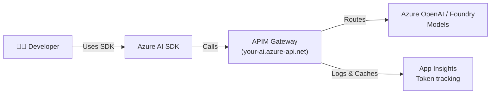
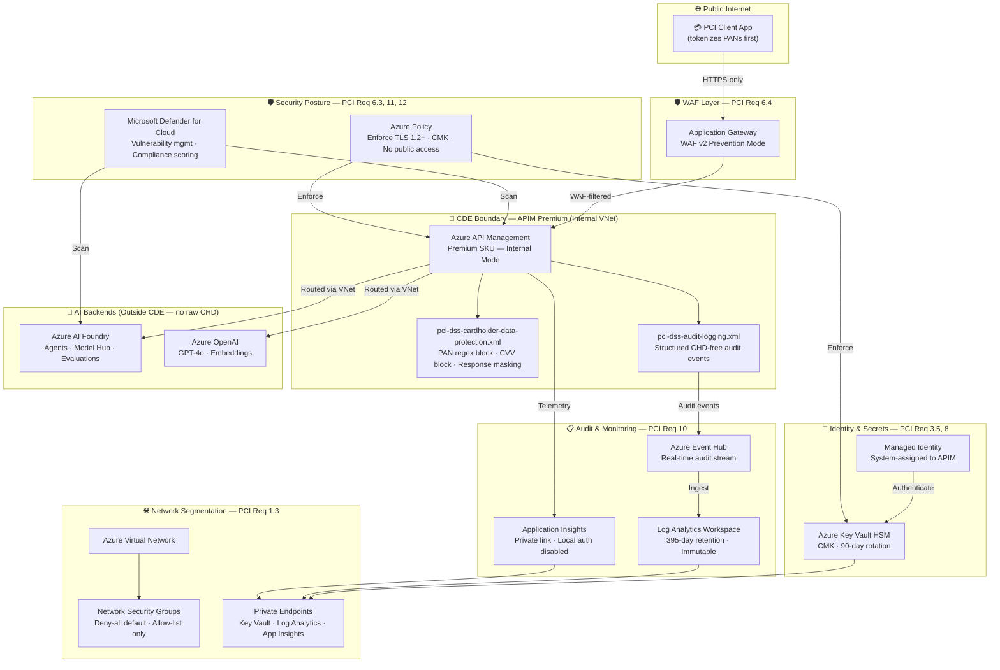

# Azure AI as a Managed Service: Enterprise Platform Guide

This repository contains the **definitive architecture and implementation patterns** for IT managers and platform engineers deploying Azure AI (LLMs, Agents, Evaluations) as a **governed, self-service platform** using:

- **Azure API Management (APIM)** - AI Gateway for cost control, security, and routing
- **Azure AI Foundry** - Agent Service, Model Hub, Evaluations  
- **Azure Application Insights** - Telemetry and observability
- **ServiceNow** - Provisioning workflow and quota management
- **Grafana** - Centralized dashboards for all AI Premium teams

## For IT Managers & Platform Engineers

👉 **Start here:** [Architecture Decision Records (ADRs)](docs/adr/) - Why we chose this approach

## For Developers

👉 **Start here:** [Developer Quick Start](docs/developer-quickstart.md) - How to build AI apps on this platform

## For Platform Engineers

👉 **Start here:** [Implementation Playbooks](docs/playbooks/) - Step-by-step setup

---

## What This Solves

| Challenge | Solution |
|-----------|----------|
| **Uncontrolled LLM costs** | APIM token quotas + semantic caching + chargeback models |
| **Security & compliance** | Centralized auth, audit logs, content safety policies |
| **Multi-team coordination** | ServiceNow provisioning, RBAC, quota governance |
| **No production observability** | Application Insights + Grafana dashboards per team |
| **Developer friction** | Simple SDK patterns, managed endpoints, no key distribution |

---

## Repository Structure

```
📁 docs/
   📄 developer-quickstart.md       ← Developers START HERE
   📁 adr/                           
      📄 adr-001-why-apim.md
      📄 adr-002-foundry-integration.md
      📄 adr-003-servicenow-workflow.md
   📁 playbooks/
      📄 setup-apim-gateway.md
      📄 setup-foundry-hub-project.md

📁 examples/
   📁 python/
      📄 1-simple-chat-via-apim.py
      📄 2-agent-with-tools.py
      📄 3-foundry-project-client.py
   📁 csharp/
      📄 1-agent-framework-apim.cs
      📄 2-project-client-setup.cs

📁 infrastructure/
   📁 bicep/
      📄 apim-gateway.bicep
      📄 foundry-hub-project.bicep
      📄 app-insights-setup.bicep

📁 policies/
   📁 apim/
      📄 token-quota-by-department.xml
      📄 semantic-caching.xml
      📄 auth-header-validation.xml
```

---

## Quick Concepts

### Developer Workflow



### What Developers See

- **One APIM subscription key** (no model keys)
- **Three API products:**
  - `/ai/inference` - Model calls (GPT-4, etc.)
  - `/ai/agents` - Agent Service (create, run threads)
  - `/ai/completions` - Simple chat interface
- **Managed identity auth** (no secrets in code)

---

## Getting Started

### For Developers

```python
# 1. Use APIM endpoint instead of direct Azure OpenAI
from azure.ai.projects import AIProjectClient
from azure.identity import DefaultAzureCredential

client = AIProjectClient(
    credential=DefaultAzureCredential(),
    project_id="your-project-id",
    # Point to your APIM gateway instead of direct Azure OpenAI
    endpoint="https://your-apim.azure-api.net"  
)

# 2. Work with agents the same way
agents_client = client.agents
agent = agents_client.create_agent(name="my-agent", model="gpt-4o")
```

See [Developer Quick Start](docs/developer-quickstart.md) for more.

### For IT Managers

1. **Deploy APIM gateway** → [setup-apim-gateway.md](docs/playbooks/setup-apim-gateway.md)
2. **Set up Foundry Hub Project** → [setup-foundry-hub-project.md](docs/playbooks/setup-foundry-hub-project.md)  
3. **Configure ServiceNow provisioning** → [servicenow-workflow.md](docs/playbooks/servicenow-workflow.md)
4. **Deploy observability stack** → [Grafana dashboards](infrastructure/bicep/)

---

## Key Features

✅ **Cost Control** - Token quotas per department/app  
✅ **Semantic Caching** - Reduce token costs by ~40% for repeated queries  
✅ **Auto-Failover** - Circuit breaker for rate limits (429)  
✅ **Audit Trail** - Every prompt + completion logged  
✅ **Managed Auth** - No API keys distributed to developers  
✅ **Multi-Region Support** - Load balance across Azure regions  
✅ **Chargeback Model** - Track spend by LOB, department, or cost center  

---

---

## PCI DSS v4.0 Compliance — Required Azure Services

This section documents every Azure service required to operate AI Foundry agents and Azure OpenAI models in a PCI DSS v4.0 compliant configuration. Services are grouped by the PCI DSS requirement they satisfy.

> **Architecture pattern:** Tokenize-then-infer. Callers must tokenize raw Primary Account Numbers (PANs) in a PCI-scoped vault **before** calling APIM. AI model backends (Foundry, OpenAI) are outside the Cardholder Data Environment (CDE) and must never receive raw cardholder data.

---

### PCI DSS Architecture Overview



---

### Required Azure Services — Full Detail

#### 1. Azure API Management (Premium SKU)
| Attribute | Value |
|---|---|
| **SKU** | Premium (Standard does not support VNet injection) |
| **VNet Mode** | Internal — APIM is not publicly reachable |
| **TLS** | TLS 1.2 minimum; TLS 1.0, 1.1, SSL 3.0 disabled via `customProperties` |
| **Encryption** | Customer-managed key (CMK) from Key Vault HSM |
| **Identity** | System-assigned managed identity (no stored credentials) |
| **PCI Policies Applied** | `pci-dss-cardholder-data-protection.xml`, `pci-dss-audit-logging.xml` |
| **PCI Product** | `ai-pci-payment` product with approval required, 1 subscription per consumer |
| **PCI Requirement** | Req 1.3, 3.4, 3.5, 4.2.1, 6.4, 7, 8, 10 |

> ⚠️ `semantic-caching.xml` and body-logging policies **must not** be applied to PCI-scoped operations.

---

#### 2. Azure AI Foundry
| Attribute | Value |
|---|---|
| **SKU** | Standard (S0) |
| **Network** | Private endpoint; no public network access |
| **Auth** | Managed identity from APIM; no API key distribution |
| **Thread TTL** | Set short (≤15 min) to avoid CHD persisting in agent threads |
| **Fine-tuning data** | Must be scanned for CHD before upload |
| **Routing** | Only reachable via APIM — never direct |
| **PCI Requirement** | Req 3.3 (don't store sensitive auth data), Req 7 (access restriction) |

---

#### 3. Azure Key Vault (HSM-backed)
| Attribute | Value |
|---|---|
| **Tier** | Premium (HSM-backed keys required for Req 3.5) |
| **Key Type** | RSA-HSM 4096-bit or EC-HSM P-384 |
| **Rotation** | Automatic 90-day rotation policy via Key Vault rotation policy |
| **Access** | Private endpoint only; public network access disabled |
| **Auth** | APIM managed identity via RBAC (`Key Vault Crypto User` role) |
| **Secrets stored** | CMK for APIM, Event Hub connection string, Log Analytics key |
| **PCI Requirement** | Req 3.5 (strong cryptography), Req 3.7 (key management lifecycle) |

---

#### 4. Azure Virtual Network + Network Security Groups
| Attribute | Value |
|---|---|
| **APIM Subnet** | `/27` minimum; delegated to APIM |
| **NSG Default** | Deny-all inbound; deny-all outbound |
| **NSG Allow-list** | Port 443 inbound from Application Gateway subnet only |
| **NSG Allow-list** | Port 443 outbound to AI Foundry and Azure OpenAI private endpoints |
| **NSG Allow-list** | APIM management port 3443 from `ApiManagement` service tag |
| **Peering** | Hub-spoke peering to shared services VNet if applicable |
| **PCI Requirement** | Req 1.3 (network controls between CDE and untrusted networks) |

---

#### 5. Application Gateway (WAF v2)
| Attribute | Value |
|---|---|
| **SKU** | WAF_v2 |
| **WAF Mode** | Prevention (Detection mode does not satisfy PCI Req 6.4) |
| **Ruleset** | OWASP CRS 3.2 + Microsoft Bot Manager |
| **Custom Rules** | Block non-HTTPS, block requests without valid subscription header |
| **TLS Termination** | TLS 1.2+ enforced at Application Gateway listener |
| **Backend** | APIM internal IP via private listener |
| **PCI Requirement** | Req 6.4 (web-facing apps protected by automated technical solution) |

> ⚠️ This is the **most commonly missed service** in PCI AI implementations. APIM alone does not satisfy Req 6.4.

---

#### 6. Azure Event Hub
| Attribute | Value |
|---|---|
| **Tier** | Standard or Premium (Premium for private endpoint) |
| **Namespace** | Dedicated to audit log streaming |
| **APIM Logger ID** | `ai-tokenlog` (configured in APIM as Event Hub logger) |
| **Retention** | 7 days in Event Hub; downstream archival to Log Analytics |
| **Auth** | APIM managed identity (`Azure Event Hubs Data Sender` role) |
| **What is logged** | Access events, auth failures, authz failures, gateway errors — **never** request/response bodies |
| **PCI Requirement** | Req 10.2.1.1–10.2.1.7 (audit log events), Req 10.3.1 (protect audit logs) |

---

#### 7. Log Analytics Workspace
| Attribute | Value |
|---|---|
| **Retention** | 395 days minimum (PCI Req 10.5.1 requires 12 months; 395 = 12 months + buffer) |
| **Immutability** | Immutability policy enabled — logs cannot be deleted or altered |
| **Access** | Private endpoint only; public ingestion and query disabled |
| **Local Auth** | Disabled (`DisableLocalAuth: true`) — only Entra ID auth |
| **Data sources** | APIM diagnostic settings (all log categories), Event Hub archive |
| **SIEM Alerts** | Brute-force detection (>10 auth failures/5 min), PAN detect in logs, log gap alert (>15 min silence) |
| **PCI Requirement** | Req 10.3.1 (protect audit logs from destruction), Req 10.5.1 (retain 12 months) |

---

#### 8. Application Insights
| Attribute | Value |
|---|---|
| **Ingestion** | Private link only (`publicNetworkAccessForIngestion: Disabled`) |
| **Query** | Private link only (`publicNetworkAccessForQuery: Disabled`) |
| **Local Auth** | Disabled (`DisableLocalAuth: true`) |
| **Workspace** | Linked to the PCI Log Analytics Workspace |
| **What is captured** | API latency, token counts, HTTP status codes, dependency traces — **never** prompt/completion content |
| **PCI Requirement** | Req 10.2 (audit trail for all component access), Req 10.7 (detect and respond to failures) |

---

#### 9. Private Endpoints + Private DNS Zones
| Service | Private DNS Zone |
|---|---|
| Key Vault | `privatelink.vaultcore.azure.net` |
| Log Analytics | `privatelink.ods.opinsights.azure.com` |
| Application Insights | `privatelink.monitor.azure.com` |
| Azure AI Foundry | `privatelink.cognitiveservices.azure.com` |
| Azure OpenAI | `privatelink.openai.azure.com` |
| Event Hub | `privatelink.servicebus.windows.net` |

**PCI Requirement:** Req 1.3 (no traffic over public internet between CDE components), Req 4.2.1 (strong cryptography in transit)

---

#### 10. Microsoft Defender for Cloud
| Attribute | Value |
|---|---|
| **Plan** | Defender CSPM (Cloud Security Posture Management) enabled |
| **Workload Plans** | Defender for APIs, Defender for Key Vault, Defender for Servers |
| **Regulatory Standard** | PCI DSS v4.0 compliance dashboard enabled |
| **Vulnerability Scanning** | Continuous scan of APIM, Foundry, and backing compute |
| **Alerts** | Threat detection forwarded to Log Analytics SIEM |
| **PCI Requirement** | Req 6.3 (identify and protect against vulnerabilities), Req 11.3 (external/internal vulnerability scans) |

---

#### 11. Azure Policy
| Policy | Effect | PCI Requirement |
|---|---|---|
| Require TLS 1.2+ on all APIM instances | Deny | Req 4.2.1 |
| Require CMK on APIM | Deny | Req 3.5 |
| Deny public network access to Key Vault | Deny | Req 1.3 |
| Deny public network access to Log Analytics | Deny | Req 10.3.1 |
| Require Log Analytics retention ≥ 395 days | Deny | Req 10.5.1 |
| Require APIM to use VNet | Deny | Req 1.3 |
| Enable Defender for Cloud on all subscriptions | DeployIfNotExists | Req 6.3, 11.3 |

**PCI Requirement:** Req 12.3 (targeted risk analyses and technical controls enforced at scale)

---

#### 12. Managed Identity (System-Assigned)
| Attribute | Value |
|---|---|
| **Assigned to** | Azure API Management instance |
| **Role assignments** | `Key Vault Crypto User` on Key Vault HSM |
| | `Azure Event Hubs Data Sender` on Event Hub namespace |
| | `Monitoring Metrics Publisher` on Application Insights |
| | `Log Analytics Contributor` on Log Analytics Workspace |
| **No secrets stored** | APIM never holds credentials; all auth via token exchange |
| **PCI Requirement** | Req 8.2 (unique IDs for all users and system components), Req 8.6 (system/app accounts managed by policies) |

---

### Service Summary Table

| # | Azure Service | PCI Requirement | Tier / Config |
|---|---|---|---|
| 1 | Azure API Management | Req 1.3, 3–4, 6–8, 10 | **Premium** (Internal VNet) |
| 2 | Azure AI Foundry | Req 3.3, 7 | Standard S0 + Private endpoint |
| 3 | Azure Key Vault | Req 3.5, 3.7 | **Premium (HSM)** + 90-day rotation |
| 4 | Azure Virtual Network + NSG | Req 1.3 | Deny-all + Allow-list NSG rules |
| 5 | Application Gateway WAF v2 | Req 6.4 | **Prevention mode** (not Detection) |
| 6 | Azure Event Hub | Req 10.2.1, 10.3.1 | Standard+ + Audit stream only |
| 7 | Log Analytics Workspace | Req 10.3.1, 10.5.1 | **395-day retention** + Immutable |
| 8 | Application Insights | Req 10.2, 10.7 | Private link + Local auth disabled |
| 9 | Private Endpoints + DNS Zones | Req 1.3, 4.2.1 | All backend services |
| 10 | Microsoft Defender for Cloud | Req 6.3, 11.3 | CSPM + Defender for APIs |
| 11 | Azure Policy | Req 12.3 | Deny-mode guardrails |
| 12 | Managed Identity | Req 8.2, 8.6 | System-assigned to APIM |

---

## Support & Questions

- 📖 [Architecture Decision Records](docs/adr/) - Why we chose each component
- 🛠️ [Implementation Playbooks](docs/playbooks/) - Step-by-step guides
- 💻 [Code Examples](examples/) - Real developer samples
- 📊 [Cost Models](docs/reference/cost-models.md) - Pricing & chargeback

---

**Last Updated:** March 2026  
**Maintained by:** Platform Engineering Team
