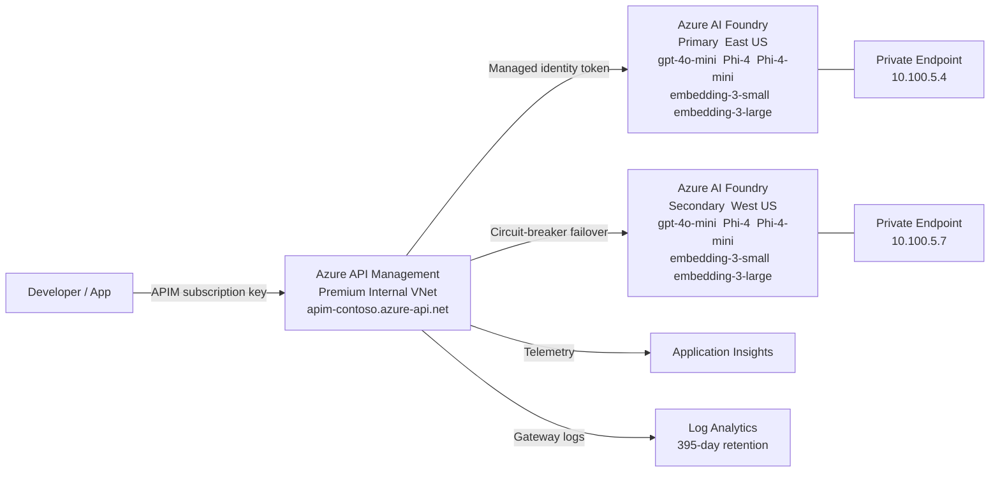
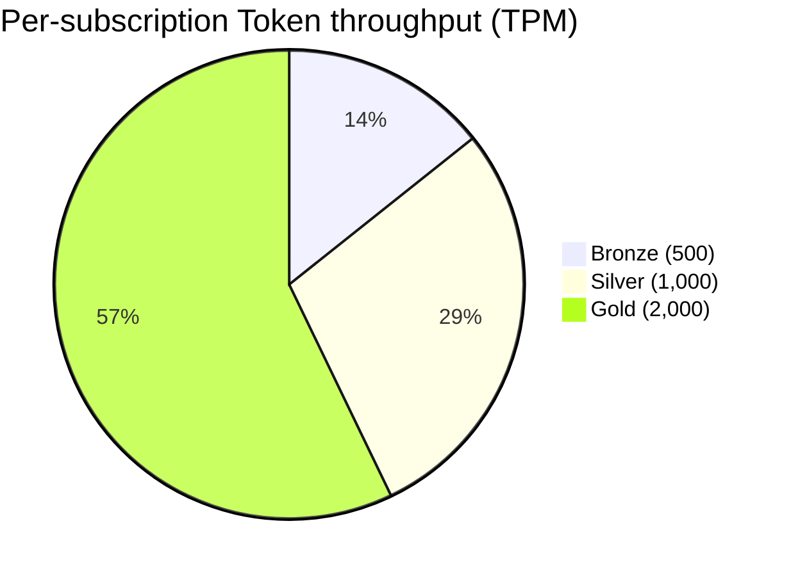
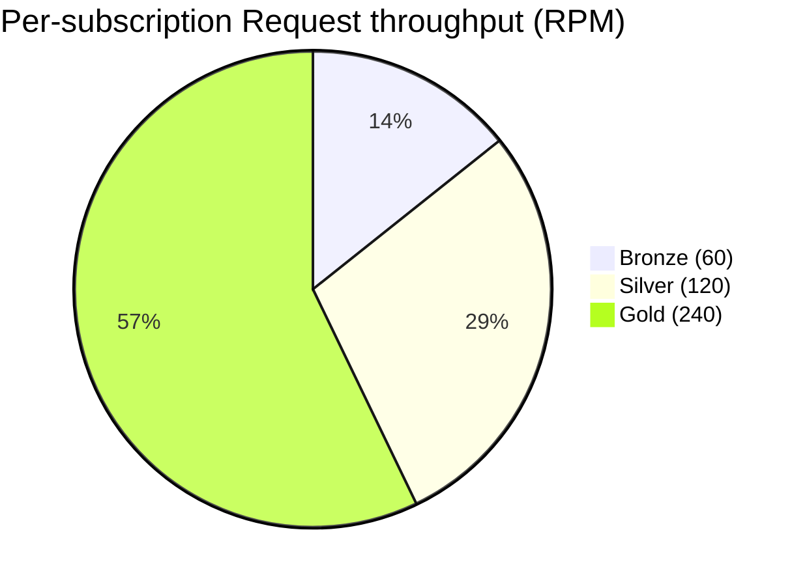

# Azure AI as a Managed Service

Enterprise platform for deploying Azure AI (LLMs, Agents, Evaluations) as a governed, self-service service  using **Azure API Management** as an AI gateway in front of **Azure AI Foundry**, with full audit logging, multi-region failover, and PCI DSS v4.0 support.

---

## Quick Start by Role

| I am a | What I do | Start here |
|---|---|---|
| **Developer** building AI apps | Builds AI-powered applications that call LLMs and agents through the platform. Uses standard OpenAI SDK — just swaps the endpoint. | [Developer Quick Start](docs/developer-quickstart.md) |
| **Platform Engineer** setting up the platform | Builds and operates the platform. Runs `azd provision`, manages Bicep and APIM policies, sets quotas, monitors dashboards, and responds to incidents. | [Deploying the Platform](#deploying-the-platform) |
| **IT Manager or Architect** evaluating the approach | Evaluates and approves the platform. Reviews architecture decisions, security model, compliance posture, and whether this approach fits organisational standards. | [Architecture Decision Records](docs/adr/) |
| **Compliance Engineer** reviewing PCI controls | Audits the platform's PCI DSS v4.0 controls — WAF, VNet isolation, CHD detection, key management, and audit logging. | [PCI DSS v4.0 Compliance](#pci-dss-v40-compliance) |

---

## What This Solves

| Challenge | Solution |
|---|---|
| **Uncontrolled LLM costs** | Per-tier TPM limits, semantic caching, chargeback by subscription key |
| **No audit trail** | Every request logged to Log Analytics  latency, token counts, status codes |
| **API key sprawl** | Developers get one APIM subscription key; no Foundry keys are distributed |
| **Single region risk** | Circuit-breaker policy fails over to West US on 429 or 5xx automatically |
| **PCI DSS compliance** | WAF, VNet isolation, private endpoints, CHD-detection policies, CMK |
| **Developer friction** | Standard OpenAI SDK works unchanged  just swap the endpoint |

---

## Platform Architecture


```mermaid
graph LR
    Dev[" Developer / App"]
    Dev -->|APIM subscription key| APIM["Azure API Management\nPremium  Internal VNet\napim-contoso.azure-api.net"]

    APIM -->|Managed identity token| F1["Azure AI Foundry\nPrimary  East US\ngpt-4o-mini  Phi-4  Phi-4-mini\nembedding-3-small  embedding-3-large"]
    APIM -->|Circuit-breaker failover| F2["Azure AI Foundry\nSecondary  West US\ngpt-4o-mini  Phi-4  Phi-4-mini\nembedding-3-small  embedding-3-large"]

    APIM -->|Telemetry| AI["Application Insights"]
    APIM -->|Gateway logs| LA["Log Analytics\n395-day retention"]

    F1 --- PE1["Private Endpoint\n10.100.5.4"]
    F2 --- PE2["Private Endpoint\n10.100.5.7"]
```

**Network isolation:** APIM runs in Internal VNet mode  it has no public inbound interface. All Foundry traffic flows over private endpoints inside the VNet. Developers reach APIM either through the ACI jumpbox (dev/test) or the App Gateway WAF (production).

**Auth flow:** Clients authenticate to APIM with a subscription key. APIM authenticates to Foundry using its system-assigned managed identity (Entra Bearer token). No Foundry keys are ever distributed.

---

## Deploying the Platform

All infrastructure is defined in Bicep and deployed with `azd`. A single `azd provision` followed by `azd deploy` creates everything from scratch  no manual Azure Portal steps required.

### Prerequisites

- [Azure Developer CLI (azd)](https://learn.microsoft.com/azure/developer/azure-developer-cli/install-azd)
- [Azure CLI](https://learn.microsoft.com/cli/azure/install-azure-cli)
- Azure subscription with **Owner** or **User Access Administrator** role (required to create RBAC assignments)

### First-time setup

```powershell
# 1. Authenticate
az login
azd auth login

# 2. Create the azd environment
azd env new dev

# 3. Provision — the setup wizard prompts for all required values on first run
azd provision

# 4. Deploy the Function App code
azd deploy
```

The first `azd provision` runs an interactive setup wizard that prompts for:

| Prompt | Default | Description |
|---|---|---|
| Primary region | `eastus` | Region for APIM, networking, and supporting infra |
| Secondary region | `westus` | Region for Foundry failover account and optional secondary App Gateway |
| Resource group name | `rg-contoso-ai-platform-<env>` | Created automatically if it doesn't exist |
| Deploying user object ID | Auto-detected | Grants your account Storage Blob access for `azd deploy` |
| Deploy RBAC assignments | Yes | Grants APIM managed identity Cognitive Services User on Foundry |
| Deploy ACI jumpbox | Yes | VNet-internal container for dev/test access to APIM |
| Deploy Function App | Yes | Event Grid automation handler |
| SSL cert Key Vault secret ID | _(blank)_ | Leave blank to skip App Gateway WAF; add later with `azd provision` |

> **Azure Load Testing is always deployed.** All 5 test definitions are created automatically by the postprovision hook — this is not a prompted option and cannot be skipped.

Re-runs skip any variable already set in the environment — the wizard only prompts for missing values.

#### Skipping prompts (CI / scripted deployments)

Pre-set all variables before running `azd provision --no-prompt`:

```powershell
azd env set AZURE_LOCATION eastus
azd env set AZURE_SECONDARY_LOCATION westus
azd env set AZURE_RESOURCE_GROUP rg-contoso-ai-platform-dev
azd env set AZURE_DEPLOYING_USER_OBJECT_ID (az ad signed-in-user show --query id -o tsv)
azd env set AZURE_DEPLOY_RBAC true
azd env set AZURE_DEPLOY_JUMPBOX true
azd env set AZURE_DEPLOY_FUNCTION_APP true
azd provision --no-prompt
azd deploy
```

### What gets provisioned

| Resource | Details |
|---|---|
| **Azure API Management** (Premium, Internal VNet) | Bronze / Silver / Gold products, 3 API surfaces, circuit-breaker policy |
| **Azure AI Foundry** × 2 | Primary (primary region) + Secondary (secondary region); gpt-4o-mini + Phi-4 + Phi-4-mini + text-embedding-3-small + text-embedding-3-large model deployments |
| **Private Endpoints** × 2 | Both Foundry accounts reachable only via private DNS (no public network access) |
| **Private DNS Zone** | `privatelink.cognitiveservices.azure.com` linked to the VNet |
| **Log Analytics Workspace** | 395-day retention; APIM gateway logs + metrics |
| **Application Insights** | API latency, token counts, HTTP status codes |
| **Key Vault** | CMK for APIM, self-signed TLS cert |
| **Managed Grafana** | Token usage + performance dashboards |
| **Function App** (Flex Consumption) | APIM subscription event handler via Event Grid |
| **ACI Jumpbox** | Linux container in VNet for testing APIM from inside the network |
| **Azure Load Testing** | 5 test definitions pre-configured with APIM subscription keys, SSL bypass, and correct endpoints — ready to fire immediately |

### Testing the deployment

#### Why you need the jumpbox

APIM runs in **Internal VNet mode** — it has no public IP. Foundry sits behind **private endpoints** with `publicNetworkAccess: Disabled`. This means:

- The Azure Portal's Foundry blade (Agents, Playgrounds) cannot reach the data plane from your browser — this is expected and intentional.
- Direct `curl` or SDK calls from your laptop to the APIM gateway URL will time out unless App Gateway WAF is deployed.
- The **ACI jumpbox** is a lightweight Linux container (`aci-contoso-jumpbox`) deployed *inside* the same VNet. It can reach APIM's internal IP and is the correct tool for verifying the deployment, running smoke tests, and interacting with Foundry agents during development.

In production, all external traffic enters via the **App Gateway WAF**, which is the only path from the internet to APIM.

#### Connect to the jumpbox

```powershell
# Resolve names from your azd environment
$RG   = (azd env get-values | Select-String 'AZURE_RESOURCE_GROUP').ToString().Split('=')[1].Trim('"')
$APIM = az apim list -g $RG --query '[0].name' -o tsv

az container exec -g $RG -n aci-contoso-jumpbox --exec-command /bin/sh
```

Then from inside the container:

```sh
APIM_NAME="<apim-name>"   # paste value from above
BRONZE_KEY="<bronze-key>" # see key retrieval below

# OpenAI-compatible surface
curl -s -X POST \
  "https://${APIM_NAME}.azure-api.net/openai/deployments/gpt-4o-mini/chat/completions?api-version=2024-02-01" \
  -H "Content-Type: application/json" \
  -H "Ocp-Apim-Subscription-Key: ${BRONZE_KEY}" \
  -d '{"messages":[{"role":"user","content":"Hello"}],"max_tokens":20}'

# Native model inference surface
curl -s -X POST \
  "https://${APIM_NAME}.azure-api.net/models/chat/completions" \
  -H "Content-Type: application/json" \
  -H "Ocp-Apim-Subscription-Key: ${BRONZE_KEY}" \
  -d '{"model":"gpt-4o-mini","messages":[{"role":"user","content":"Hello"}],"max_tokens":20}'
```

#### Retrieve subscription keys

```powershell
$RG   = (azd env get-values | Select-String 'AZURE_RESOURCE_GROUP').ToString().Split('=')[1].Trim('"')
$APIM = az apim list -g $RG --query '[0].name' -o tsv

# Bronze key (app-branch-advisor LOB)
az apim subscription show --service-name $APIM -g $RG --subscription-id app-branch-advisor --query primaryKey -o tsv

# Silver key (app-aml-screening LOB)
az apim subscription show --service-name $APIM -g $RG --subscription-id app-aml-screening --query primaryKey -o tsv
```

---

## Load Testing

All five load test definitions are **created automatically by `azd provision`** — no manual setup needed. The postprovision hook (`scripts/configure-load-test.ps1`) runs unconditionally and registers every test definition in Azure Load Testing, injects the correct APIM subscription keys, and uploads the SSL bypass files. After `azd provision && azd deploy` every test is ready to fire immediately.

All tests route traffic through App Gateway WAF → APIM → Foundry. Run any script from the repo root — it will resolve all resource names automatically from your `azd` environment.

### Adding a new load test

1. Add your JMX file to `load_tests/definitions/`.
2. Add a `Register-AltTest` call in `scripts/configure-load-test.ps1` (the single owner of all test definitions).
3. Add a `run-<name>.ps1` script that only fires the run (does not create the definition).
4. Run `azd provision` — the new test definition will be created automatically.

### Test scripts

| Script | ALT test ID | Duration | What it proves |
|---|---|---|---|
| `scripts/run-apim-smoke-test.ps1` | `apim-smoke-test` | ~2 min | Direct APIM smoke test — validates the internal VNet path (no App Gateway) is healthy |
| `scripts/run-appgw-failover-test.ps1` | `appgw-failover-test` | ~2 min | Circuit breaker fires and APIM transparently retries on secondary Foundry |
| `scripts/run-multi-sub-failover-test.ps1` | `multi-sub-failover-test` | ~2 min | Bronze **and** Silver subscriptions both fail over independently under shared TPM pressure |
| `scripts/run-steady-state-test.ps1` | `steady-state-test` | 1 hour | All four LOB subscriptions produce smooth baseline traffic — no throttling, no gaps in dashboards |
| `scripts/run-appgw-smoke-test.ps1` | `appgw-smoke-test` | ~5 min | Measures WAF inspection overhead vs the direct-APIM baseline latency (~10–30 ms expected) |

### Choosing the right test

- **Verifying the deployment is healthy** → `run-apim-smoke-test.ps1`  
  Hits APIM directly over the internal VNet path (no App Gateway). This is the fastest way to confirm gpt-4o-mini is reachable and the Bronze/Silver subscription keys are valid. Run this immediately after `azd provision && azd deploy`.

> **`run-load-test.ps1`** is an interactive launcher that presents all 5 tests with descriptions and recommendations — useful when you’re not sure which test to run.

- **Validating the failover policy after a change** → `run-appgw-failover-test.ps1`  
  Deliberately exhausts the primary Foundry TPM cap and confirms every request still returns HTTP 200 via the secondary, with `X-Backend-Region-Used: secondary-failover` in the response.

- **Proving multi-LOB isolation** → `run-multi-sub-failover-test.ps1`  
  Runs Bronze and Silver blast suites concurrently. Use this when you need to demonstrate that one tenant's burst does not black out another tenant's subscription.

- **Populating monitoring dashboards / alerting baselines** → `run-steady-state-test.ps1`  
  Sends ~160 TPM across four LOB subscriptions for one hour — well under the 1K TPM cap so no failover occurs. Run this overnight to generate realistic traffic for Grafana and the App Insights workbook.  
  Can run **concurrently** with `run-multi-sub-failover-test.ps1` (different ALT test ID).

- **Measuring App Gateway WAF overhead** → `run-appgw-smoke-test.ps1`  
  Compares AppGW-path latency against the stored direct-APIM baseline. Use after updating WAF rules or upgrading the App Gateway SKU to confirm the overhead stays within acceptable bounds.

### Reading the results

After any test completes the script prints a summary table. For deeper analysis:

```powershell
# Open the failover analysis workbook
scripts/analyze-appinsights.ps1

# Check circuit breaker state across backends
scripts/check-circuit-breaker-cache.ps1
```

---

## Platform Concepts

### Subscription Tiers

Developers request access through ServiceNow and receive a single APIM subscription key scoped to a tier:

| Tier | Models | TPM | RPM | Approval | Use case |
|---|---|---|---|---|---|
| **Bronze** | gpt-4o-mini, Phi-4, Phi-4-mini, text-embedding-3-small | 500 | 60 | Self-service | Dev/test, low-volume apps |
| **Silver** | gpt-4o, gpt-4o-mini, Phi-4, Phi-4-mini, Llama-3, text-embedding-3-small + Agents API | 1,000 | 120 | Self-service | Production workloads |
| **Gold** | All models incl. text-embedding-3-large + Agents API (PCI DSS scope eligible) | 2,000 | 240 | Requires approval | High-volume / PCI workloads |

> **TPM** (Tokens Per Minute) — counts the combined prompt + completion tokens across all requests in the current minute window. A typical short chat exchange is ~500–1,000 tokens; a document-processing request may be 4,000–8,000 tokens.  
> **RPM** (Requests Per Minute) — counts the number of API calls regardless of their size. A 10-token ping and a 4,000-token document request both count as 1 RPM.

#### Model access matrix

| Model | Bronze | Silver | Gold |
|---|:---:|:---:|:---:|
| `gpt-4o-mini` | ✓ | ✓ | ✓ |
| `phi-4` | ✓ | ✓ | ✓ |
| `phi-4-mini` | ✓ | ✓ | ✓ |
| `text-embedding-3-small` | ✓ | ✓ | ✓ |
| `gpt-4o` | — | ✓ | ✓ |
| `llama-3` / `meta-llama` | — | ✓ | ✓ |
| `text-embedding-3-large` | — | — | ✓ |
| *(future models)* | — | — | ✓ |
| **Agents API** | — | ✓ | ✓ |

> **TPM limits are aggregate, not per-model.** A Bronze subscription has a single 500 TPM bucket shared across all three models it can access — calling `phi-4-mini` and `gpt-4o-mini` draws from the same counter. This keeps enforcement simple and predictable. If your workload needs to guarantee capacity for a high-priority model independently of batch traffic on a cheaper model, request a Silver or Gold tier where the larger bucket reduces contention, or open a quota increase request via ServiceNow.

#### How quota works in this platform

Quota operates at **two independent layers** stacked in series:

```
Your app (subscription key)
    │
    ▼
Layer 2 — APIM product limit (enforced per subscription key, per minute)
    │  → Returns HTTP 429 with a Retry-After header if your key exceeds its tier's TPM or RPM cap
    ▼
Layer 1 — Foundry deployment capacity (enforced by Azure, shared across ALL callers on the platform)
    │  → Returns HTTP 429 if the sum of all traffic saturates the total deployment capacity
    ▼
Model
```

**What this means in practice:**
- When your app gets a 429, it is almost always APIM enforcing your tier's limit (Layer 2). The response includes a `Retry-After` header. Implement exponential back-off in your client.
- If the platform-wide Foundry capacity is saturated (Layer 1), the APIM circuit-breaker policy automatically fails over to the West US secondary before returning a 429 to callers.
- These are separate from [Microsoft's Foundry quota tier system](https://learn.microsoft.com/en-us/azure/foundry/openai/quotas-limits) (Tier 1–6 per Azure subscription), which governs how much total capacity the platform operator can allocate — not what your individual subscription key can use.

> For full details — including how to view current usage, request a Foundry quota increase from Microsoft, and adjust tier limits — see [docs/playbooks/quota-management.md](docs/playbooks/quota-management.md).


```mermaid
pie title Per-subscription Token throughput (TPM)
    "Bronze (500)" : 500
    "Silver (1,000)" : 1000
    "Gold (2,000)" : 2000
```


```mermaid
pie title Per-subscription Request throughput (RPM)
    "Bronze (60)" : 60
    "Silver (120)" : 120
    "Gold (240)" : 240
```

> All tiers include multi-region circuit-breaker failover (East US → West US). Gold requires manual approval and is limited to one subscription per customer (PCI DSS Req 7).

### API Surfaces

Three endpoints are available under the same APIM gateway. All three are included in every tier:

| Surface | Path prefix | SDK | Best for |
|---|---|---|---|
| **OpenAI Inference** | `/openai/...` | `openai` Python / `Azure.AI.OpenAI` .NET | Existing OpenAI code, gpt-4o models |
| **Model Inference** | `/models/...` | `azure-ai-inference` | Phi-4, provider-agnostic clients |
| **Foundry Agents** | `/agents/v1.0/...` | `azure-ai-projects` | Stateful agent / thread workflows (Silver + Gold) |

### Multi-Region Failover

The circuit-breaker policy routes to **Foundry Primary (East US)** by default and fails over to **Foundry Secondary (West US)** automatically when the primary returns 429 (rate limited) or 5xx (error). No client-side changes needed.

---

## API Reference

### `/openai`  OpenAI-compatible inference

For developers with existing OpenAI SDK code. Swap the endpoint; nothing else changes:

```python
from openai import AzureOpenAI

client = AzureOpenAI(
    azure_endpoint="https://<apim-name>.azure-api.net/openai",
    api_key="<apim-subscription-key>",
    api_version="2024-10-21"
)
response = client.chat.completions.create(
    model="gpt-4o-mini",
    messages=[{"role": "user", "content": "Hello"}]
)
```

### `/models`  Native Foundry inference (recommended for Phi-4)

Provider-agnostic schema. Phi-4 and all Microsoft-family models work best here:

```python
from azure.ai.inference import ChatCompletionsClient
from azure.core.credentials import AzureKeyCredential

client = ChatCompletionsClient(
    endpoint="https://<apim-name>.azure-api.net/models",
    credential=AzureKeyCredential("<apim-subscription-key>")
)
response = client.complete(
    model="phi-4",          # also: "phi-4-mini"
    messages=[{"role": "user", "content": "Hello"}]
)
```

### `/agents`  Stateful Foundry Agents (Silver / Gold)

Stateful session model  create an agent, open a thread, send messages, poll for results:

```python
from azure.ai.projects import AIProjectClient
from azure.core.credentials import AzureKeyCredential

client = AIProjectClient(
    endpoint="https://<apim-name>.azure-api.net",
    credential=AzureKeyCredential("<apim-subscription-key>")
)
agent = client.agents.create_agent(model="gpt-4o-mini", name="my-agent")
thread = client.agents.create_thread()
run = client.agents.create_and_process_run(thread_id=thread.id, agent_id=agent.id)
messages = client.agents.list_messages(thread_id=thread.id)
```

See [examples/python/](examples/python/) and [examples/csharp/](examples/csharp/) for full working samples.

---

## Repository Structure

```
infrastructure/
  bicep/
    main.bicep                     azd provision entry point
    networking.bicep               VNet + subnets + private endpoint subnet
    foundry-hub-project.bicep      2 AIServices accounts + private endpoints + DNS
    apim-gateway.bicep             APIM Premium + 3 APIs + Bronze/Silver/Gold policies
    foundry-apim-rbac.bicep        Cognitive Services User grant for APIM identity
    event-grid-automation.bicep    Function App + storage + Event Grid
    supporting-infra.bicep         Log Analytics + Key Vault
    managed-grafana.bicep          Grafana dashboards
    waf-appgw.bicep                App Gateway WAF v2 (production  requires SSL cert)
  terraform/                       Terraform equivalents (apim-gateway, foundry-hub-project)

automation/
  functions/                       APIM subscription event handler (Python, Flex Consumption)
  servicenow/                      Provisioning & quota request workflows

policies/
  apim/
    auth-header-validation.xml
    token-quota-by-department.xml
    semantic-caching.xml
    circuit-breaker-multi-region.xml
    pci-dss-cardholder-data-protection.xml
    pci-dss-audit-logging.xml
    circuit-breaker-guide.md          Circuit breaker deployment guide
    mock-responses.md                 APIM mock responses for load testing

observability/
  grafana/dashboards/
    performance-dashboard.json
    token-usage-dashboard.json

examples/
  python/                          6 working examples (simple chat  Foundry agents)
  csharp/                          4 working examples

docs/
  developer-quickstart.md
  developer-workflow-30days.md
  adr/                             Architecture Decision Records (why APIM, Foundry, etc.)
  playbooks/                       Step-by-step operator guides
  reference/
    sdk-endpoint-questions.md        SDK endpoint FAQ and answers
    sdk-endpoint-verification.md     SDK endpoint risk analysis
    sdk-source-code-investigation.md SDK source code review guide

scripts/
  entra-id/                        Group and project provisioning scripts

load_tests/
  test-sdk-endpoint-routing.py
```

---

## Observability

The platform uses two complementary monitoring layers. They answer different questions and are both always active:

| Layer | Where data lives | What it captures | Primary use |
|---|---|---|---|
| **App Gateway + APIM logs → Log Analytics** | `AGWAccessLogs`, `ApiManagementGatewayLogs` tables in LAW | Every HTTP request at the network/gateway level — WAF rule hits, TLS negotiation, backend routing, raw latency at each hop | Backend routing workbook, WAF forensics, PCI audit trail |
| **APIM → Application Insights → Log Analytics** | `AppRequests`, `AppDependencies` tables in the same LAW | Request-level SDK telemetry — operation names, per-request distributed trace IDs, Foundry backend dependency spans, custom dimensions (X-Correlation-Id, model, tier) | E2E trace workbook, latency breakdown script, Grafana dashboards |

### Why both layers?

`AGWAccessLogs` alone tells you that a request arrived at the WAF and was forwarded to APIM, and what the final HTTP status code was. It cannot tell you:

- Which APIM operation or product tier handled it
- How much time APIM spent vs. how much Foundry spent (APIM overhead vs. inference latency)
- Whether a 429 came from APIM rate-limiting or from Foundry capacity
- The W3C `traceparent` / `X-Correlation-Id` needed to join events across all three layers

App Insights fills that gap. Because it's **workspace-based** (linked to the same `law-contoso-ai-dev`), both sources land in the same Log Analytics workspace and can be joined in a single KQL query — which is what the E2E trace workbook does.

### How the per-request Jaeger-style waterfall works

The goal is a trace view like this — three layers, one timeline, per-request:

```
Request abc-123 (total 420ms)
├── App Gateway WAF          ░░░░░░░░░░░░░░░░░░░░░░░░  420ms  (AGWAccessLogs.timeTaken)
│   └── APIM processing      ░░░░░░░░░░░░░░░░░░         400ms  (AppRequests.DurationMs)
│       └── Foundry inference           ░░░░░░░░░░░░    310ms  (AppDependencies.DurationMs)
```

This works through a three-step correlation chain:

**Step 1 — App Gateway creates and stamps the correlation key.**
The `inject-correlation-id` rewrite rule in `waf-appgw.bicep` sets `X-Correlation-Id` on every request it forwards to APIM. The value is composed from two App Gateway server variables:

```
X-Correlation-Id: {var_client_ip}-{var_client_port}
```

Example: `10.0.0.1-50234`

App Gateway has no built-in per-request UUID generator, so the ID is derived from the TCP 4-tuple instead. The **client source port** is unique per active connection: the OS cannot reuse the same `client_ip:client_port` pair for a new TCP connection while the original connection is still open. This makes the value unique within any live request window without requiring a UUID. The same header is echoed back to the calling client on the response, so client-side logs can correlate against the platform trace without any portal access.

> **Why not `{var_request_id}`?**  App Gateway exposes `{var_request_id}` in some documentation, but it is only populated for WebSocket connections in practice. For HTTP/HTTPS requests it is empty, which would produce an unusable blank correlation key. The `client_ip-client_port` composition is the reliable pattern for HTTP traffic.

**Step 2 — APIM captures and forwards the ID.**
The global policy in `apim-gateway.bicep` reads `X-Correlation-Id` from the inbound header with a graceful fallback for direct VNet calls that bypass App Gateway:

```csharp
context.Request.Headers.ContainsKey("X-Correlation-Id")
  ? context.Request.Headers["X-Correlation-Id"][0]
  : context.RequestId.ToString()   // fallback: APIM's own request GUID
```

The value is stored in the `correlationId` policy variable, re-stamped onto the outbound request to Foundry, and echoed back to the client in the outbound section. The APIM diagnostics configuration captures it in App Insights as `AppRequests.Properties["Request-X-Correlation-Id"]`.

**Step 3 — App Insights links the APIM span to the Foundry span.**
APIM's `httpCorrelationProtocol: W3C` setting means every outbound call to Foundry is recorded as an `AppDependencies` row sharing the same `OperationId` as its parent `AppRequests` row. The three rows — `AGWAccessLogs`, `AppRequests`, `AppDependencies` — are joined on `X-Correlation-Id` and `OperationId` to reconstruct the full waterfall.

**Why App Insights (not just APIM gateway logs) is required for this:**
`ApiManagementGatewayLogs` records an aggregate `TotalTime` and `BackendTime` per request, but only at the minute-level granularity in Log Analytics. It has no concept of W3C distributed trace IDs and cannot link an individual APIM call to a specific Foundry backend span. App Insights is the only source that emits the parent/child span relationship needed to calculate `APIM overhead = APIM DurationMs − Foundry DurationMs` at the individual-request level.

### Workbooks

Two workbooks are automatically deployed by `azd provision` into `rg-contoso-ai-platform-dev`. They answer different questions and are intentionally kept separate because they draw from different data sources and operate at different granularities.

| Workbook | Display name | Data sources | Granularity |
|---|---|---|---|
| [Backend Routing Report](#backend-routing-report) | `AppGW → APIM → Foundry Backend Routing Report` | `ApiManagementGatewayLogs`, `AGWAccessLogs` | Aggregate — trends over time |
| [End-to-End Trace](#end-to-end-trace) | `AppGW → APIM → Foundry End-to-End Trace` | `AGWAccessLogs`, `AppRequests`, `AppDependencies` | Per-request — individual trace rows |

After `azd provision`, find your workbooks in the Azure portal:
**Azure Monitor → Workbooks** — filter by your resource group (`rg-contoso-ai-platform-<env>`). Both workbooks appear with their display names.

#### Backend Routing Report

**Use this when:** you want to understand traffic patterns and failover behaviour over a time window — e.g. after a load test, during an incident, or for a weekly capacity review.

**Data source:** `ApiManagementGatewayLogs` and `AGWAccessLogs` in Log Analytics. These are raw gateway-level logs — every request APIM processes produces a row regardless of whether App Insights is configured. This makes the workbook reliable even if the App Insights instrumentation key is missing or the APIM diagnostics resource is misconfigured.

**Panels (top to bottom):**

| Panel | What it answers |
|---|---|
| **Traffic Summary** (KPI tiles) | Total requests, primary-backend count, secondary-backend count, APIM-rejected count (i.e. rate-limited before reaching a backend) |
| **Requests per Backend** (area chart) | Timeline of request volume split by Primary (East US) vs Secondary (West US) vs No-backend — lets you see the moment primary saturation kicks in and traffic shifts to secondary |
| **Backend Switch Events** (table) | Each individual transition between primary and secondary. Direction labels: `🔴 Failover: primary → secondary (error re-routed)` — primary returned 429/5xx and breaker tripped; `🔴 Failover: primary → secondary` — mid-request retry succeeded on secondary; `🟡 Recovery attempt: secondary → primary (failed — re-tripped)` — breaker reset timer fired but primary rejected with 429/5xx and immediately re-tripped; `🟢 Recovery: secondary → primary (successful)` — primary healthy again. Useful for measuring how long a failover episode lasted and distinguishing genuine recoveries from flapping. |
| **Primary Backend Failures per Minute** (line chart) | 429 + 5xx count from the primary backend only, overlaid with a reference line at the circuit-breaker threshold (5 failures/min) |
| **Error Rate % by Backend** (line chart) | Error percentage per minute split by primary vs secondary — shows whether the secondary is clean after a failover |
| **Full Chain Latency: AppGW → APIM → Foundry — P50 and P90** (line chart) | End-to-end wall-clock latency as seen by App Gateway, sampled at P50 and P90. Derived from `AGWAccessLogs.timeTaken` joined to APIM backend time |
| **APIM Latency by Backend — P50 / P90** (line chart) | APIM-only latency broken out by primary vs secondary — lets you see the cross-region overhead of the West US secondary (typically +300–500 ms) |
| **Full Request Chain — AppGW → APIM → Foundry (latest 500 requests)** (table) | One row per request: AppGW time, APIM total time, APIM backend time, computed APIM overhead, backend URL, HTTP status, `X-Correlation-Id` |

**Limitation:** Because it uses `ApiManagementGatewayLogs` rather than App Insights spans, it cannot decompose APIM overhead vs Foundry inference time at the individual-request level with full accuracy — that requires the distributed trace data in the E2E Trace workbook.

---

#### End-to-End Trace

**Use this when:** you want to investigate a specific slow request, correlate a WAF block with the APIM operation that followed, or measure per-layer latency percentiles (P50/P95/P99) across all three hops together.

**Data source:** `AGWAccessLogs` joined to `AppRequests` and `AppDependencies` via `X-Correlation-Id` and W3C `OperationId`. Requires App Insights to be correctly wired to APIM (the `apim-gateway.bicep` `applicationInsights` diagnostics resource) and the `inject-correlation-id` rewrite rule on the App Gateway to be active. If either is missing, the per-request join will produce no rows.

**Panels (top to bottom):**

| Panel | What it answers |
|---|---|
| **Traffic overview** (KPI tiles) | Total APIM-correlated requests in the selected time range, p50/p95/p99 latency, error count — quick health check for the window |
| **Avg latency per layer** (stacked bar, 5-min buckets) | AppGW processing time, APIM overhead (APIM total minus Foundry duration), and Foundry inference time stacked per bucket — shows which layer dominates latency and whether a spike was a Foundry issue or an APIM/WAF issue |
| **Per-request trace table** (table, latest 200 rows) | One row per individual request: AppGW wall time, APIM duration, Foundry dependency duration, computed APIM overhead, HTTP status, backend region (`primary` / `secondary-failover`), `X-Correlation-Id` — click any `X-Correlation-Id` to jump to the App Insights transaction search for the full distributed trace |
| **Latency percentiles by layer** (table) | P50 / P75 / P90 / P95 / P99 for each of the three layers side by side — useful for SLO analysis |
| **WAF rule matches / blocks** (table) | `AGWAccessLogs` rows where `ruleSetType` is set, showing which OWASP or Bot Manager rules fired and against which request URI — correlates WAF events with APIM telemetry in the same time window |

**Why this workbook cannot replace the Backend Routing Report:**  
`AppRequests` / `AppDependencies` data in App Insights has a default ingestion delay of 2–5 minutes and is sampled if the App Insights instance is under load. `ApiManagementGatewayLogs` is unsampled and ingests within 30 seconds. For real-time incident response, start with the Backend Routing Report; use the E2E Trace workbook for post-incident root-cause analysis.

### Analysis scripts

```powershell
# Full traffic breakdown for a time window (e.g. after a load test)
pwsh scripts/analyze-appinsights.ps1 -StartTime "2026-03-24T17:49:00Z" -EndTime "2026-03-24T17:58:00Z"
```

Outputs 6 sections: APIM request breakdown, Foundry dependency calls, APIM overhead vs. Foundry inference latency split, error detail, per-minute rate, and `X-Correlation-Id` propagation coverage.

---

## PCI DSS v4.0 Compliance

See [README-pci.md](README-pci.md) for the full PCI DSS v4.0 compliance documentation, including the required service list, architecture overview, policy guardrails, and service summary table.

---

## Further Reading

- [Architecture Decision Records](docs/adr/)  why APIM, why Foundry, why this network topology
- [Implementation Playbooks](docs/playbooks/)  step-by-step operator guides
- [Developer Quick Start](docs/developer-quickstart.md)  how developers onboard and call the APIs
- [Code Examples](examples/)  Python and C# samples for all API surfaces
- [PCI DSS Configuration Playbook](docs/playbooks/pci-dss-configuration.md)  detailed PCI setup guide

---

**Last Updated:** April 2026  Maintained by Platform Engineering
