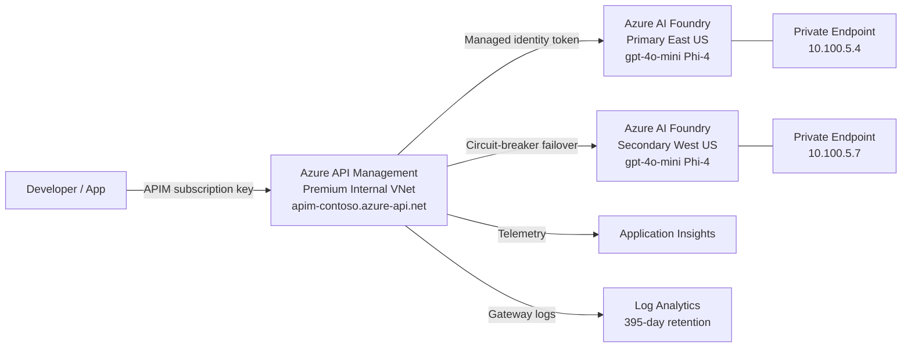
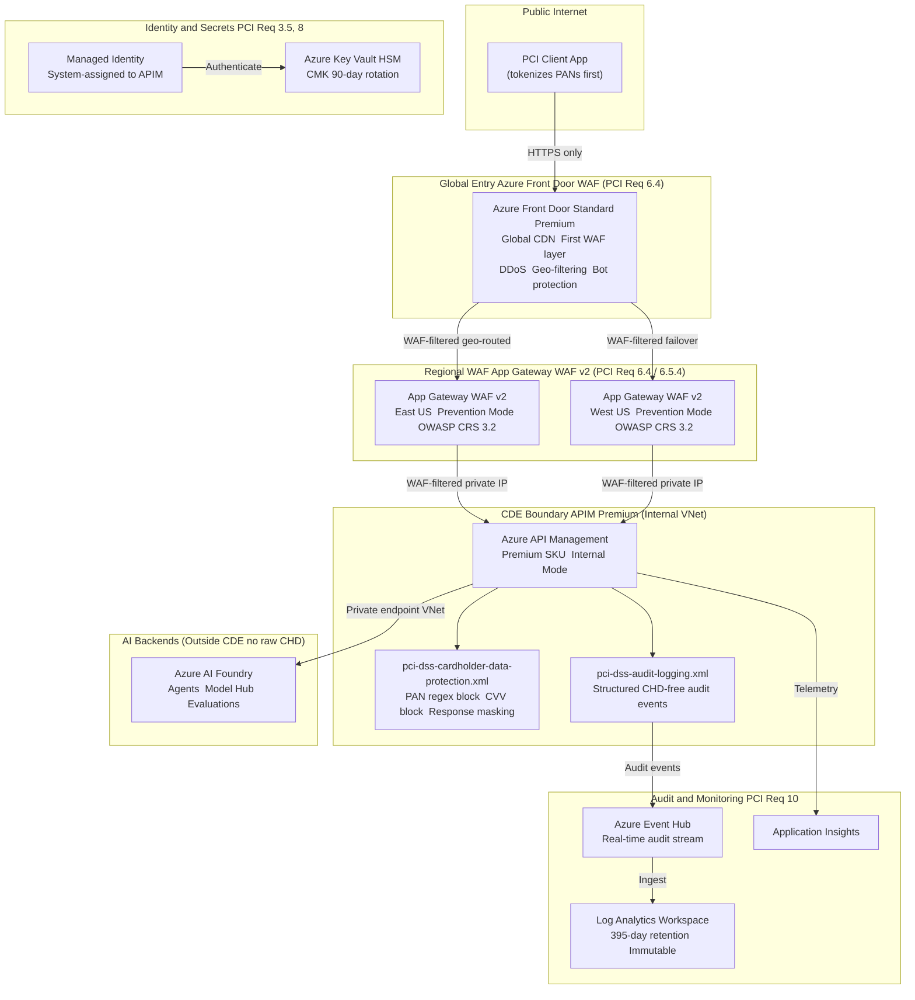

# Azure AI as a Managed Service

Enterprise platform for deploying Azure AI (LLMs, Agents, Evaluations) as a governed, self-service service  using **Azure API Management** as an AI gateway in front of **Azure AI Foundry**, with full audit logging, multi-region failover, and PCI DSS v4.0 support.

---

## Quick Start by Role

| I am a | Start here |
|---|---|
| **Developer** building AI apps | [Developer Quick Start](docs/developer-quickstart.md) |
| **Platform Engineer** setting up the platform | [Deploying the Platform](#deploying-the-platform) |
| **IT Manager or Architect** evaluating the approach | [Architecture Decision Records](docs/adr/) |
| **Compliance Engineer** reviewing PCI controls | [PCI DSS v4.0 Compliance](#pci-dss-v40-compliance) |

---

## What This Solves

| Challenge | Solution |
|---|---|
| **Uncontrolled LLM costs** | Per-tier TPM limits, semantic caching, chargeback by subscription key |
| **No audit trail** | Every request logged to Log Analytics  latency, token counts, status codes |
| **API key sprawl** | Developers get one APIM subscription key; no Foundry keys are distributed |
| **Single region risk** | Circuit-breaker policy fails over to West US on 429 or 5xx automatically |
| **PCI DSS compliance** | WAF, VNet isolation, private endpoints, CHD-detection policies, CMK |
| **Developer friction** | Standard OpenAI SDK works unchanged  just swap the endpoint |

---

## Platform Architecture


```mermaid
graph LR
    Dev[" Developer / App"]
    Dev -->|APIM subscription key| APIM["Azure API Management\nPremium  Internal VNet\napim-contoso.azure-api.net"]

    APIM -->|Managed identity token| F1["Azure AI Foundry\nPrimary  East US\ngpt-4o-mini  Phi-4"]
    APIM -->|Circuit-breaker failover| F2["Azure AI Foundry\nSecondary  West US\ngpt-4o-mini  Phi-4"]

    APIM -->|Telemetry| AI["Application Insights"]
    APIM -->|Gateway logs| LA["Log Analytics\n395-day retention"]

    F1 --- PE1["Private Endpoint\n10.100.5.4"]
    F2 --- PE2["Private Endpoint\n10.100.5.7"]
```

**Network isolation:** APIM runs in Internal VNet mode  it has no public inbound interface. All Foundry traffic flows over private endpoints inside the VNet. Developers reach APIM either through the ACI jumpbox (dev/test) or the App Gateway WAF (production).

**Auth flow:** Clients authenticate to APIM with a subscription key. APIM authenticates to Foundry using its system-assigned managed identity (Entra Bearer token). No Foundry keys are ever distributed.

---

## Deploying the Platform

All infrastructure is defined in Bicep and deployed with `azd`. A single `azd provision` followed by `azd deploy` creates everything from scratch  no manual Azure Portal steps required.

### Prerequisites

- [Azure Developer CLI (azd)](https://learn.microsoft.com/azure/developer/azure-developer-cli/install-azd)
- [Azure CLI](https://learn.microsoft.com/cli/azure/install-azure-cli)
- Azure subscription with **Owner** or **User Access Administrator** role (required to create RBAC assignments)

### First-time setup

```powershell
# 1. Authenticate
az login
azd auth login

# 2. Create the azd environment
azd env new dev

# 3. Configure deployment flags
azd env set AZURE_DEPLOY_RBAC true           # grants APIM  Foundry Cognitive Services User
azd env set AZURE_DEPLOY_JUMPBOX true        # deploys ACI jumpbox for VNet-internal testing
azd env set AZURE_DEPLOY_FUNCTION_APP true   # deploys the Event Grid automation Function App
azd env set AZURE_RESOURCE_GROUP rg-contoso-ai-platform-dev

# 4. Capture deploying user's object ID (grants storage access for azd deploy)
azd env set AZURE_DEPLOYING_USER_OBJECT_ID (az ad signed-in-user show --query id -o tsv)

# 5. Provision all infrastructure (~6 minutes)
azd provision --no-prompt

# 6. Deploy the Function App code
azd deploy
```

### What gets provisioned

| Resource | Details |
|---|---|
| **Azure API Management** (Premium, Internal VNet) | Bronze / Silver / Gold products, 3 API surfaces, circuit-breaker policy |
| **Azure AI Foundry**  2 | Primary East US + Secondary West US; gpt-4o-mini + Phi-4 model deployments |
| **Private Endpoints**  2 | Both Foundry accounts reachable only via private DNS (no public network access) |
| **Private DNS Zone** | `privatelink.cognitiveservices.azure.com` linked to the VNet |
| **Log Analytics Workspace** | 395-day retention; APIM gateway logs + metrics |
| **Application Insights** | API latency, token counts, HTTP status codes |
| **Key Vault** | CMK for APIM, self-signed TLS cert |
| **Managed Grafana** | Token usage + performance dashboards |
| **Function App** (Flex Consumption) | APIM subscription event handler via Event Grid |
| **ACI Jumpbox** | Linux container in VNet for testing APIM from inside the network |

### Testing the deployment

Connect to the jumpbox:

```powershell
az container exec -g rg-contoso-ai-platform-dev -n aci-contoso-jumpbox --exec-command /bin/sh
```

Then from inside the container:

```sh
# OpenAI-compatible surface
curl -s -X POST \
  "https://<apim-name>.azure-api.net/openai/deployments/gpt-4o-mini/chat/completions?api-version=2024-02-01" \
  -H "Content-Type: application/json" \
  -H "Ocp-Apim-Subscription-Key: <bronze-key>" \
  -d '{"messages":[{"role":"user","content":"Hello"}],"max_tokens":20}'

# Native model inference surface
curl -s -X POST \
  "https://<apim-name>.azure-api.net/models/chat/completions" \
  -H "Content-Type: application/json" \
  -H "Ocp-Apim-Subscription-Key: <bronze-key>" \
  -d '{"model":"gpt-4o-mini","messages":[{"role":"user","content":"Hello"}],"max_tokens":20}'
```

Retrieve subscription keys:

```powershell
# Bronze key
az apim subscription show --service-name <apim-name> -g rg-contoso-ai-platform-dev --subscription-id bronze-test --query primaryKey -o tsv

# Silver key
az apim subscription show --service-name <apim-name> -g rg-contoso-ai-platform-dev --subscription-id silver-test --query primaryKey -o tsv
```

---

## Platform Concepts

### Subscription Tiers

Developers request access through ServiceNow and receive a single APIM subscription key scoped to a tier:

| Tier | Models | TPM | RPM | Approval | Use case |
|---|---|---|---|---|---|
| **Bronze** | gpt-4o-mini, Phi-4 | 10,000 | 60 | Self-service | Dev/test, low-volume apps |
| **Silver** | gpt-4o, gpt-4o-mini, Phi-4, Llama-3 + Agents API | 50,000 | 300 | Self-service | Production workloads |
| **Gold** | All models + Agents API (PCI DSS scope eligible) | 200,000 | Unlimited | Requires approval | High-volume / PCI workloads |

> **TPM** = Tokens Per Minute estimated at request time (prompt + completion).  
> **RPM** = Requests Per Minute enforced per subscription key.

### API Surfaces

Three endpoints are available under the same APIM gateway. All three are included in every tier:

| Surface | Path prefix | SDK | Best for |
|---|---|---|---|
| **OpenAI Inference** | `/openai/...` | `openai` Python / `Azure.AI.OpenAI` .NET | Existing OpenAI code, gpt-4o models |
| **Model Inference** | `/models/...` | `azure-ai-inference` | Phi-4, provider-agnostic clients |
| **Foundry Agents** | `/agents/v1.0/...` | `azure-ai-projects` | Stateful agent / thread workflows (Silver + Gold) |

### Multi-Region Failover

The circuit-breaker policy routes to **Foundry Primary (East US)** by default and fails over to **Foundry Secondary (West US)** automatically when the primary returns 429 (rate limited) or 5xx (error). No client-side changes needed.

---

## API Reference

### `/openai`  OpenAI-compatible inference

For developers with existing OpenAI SDK code. Swap the endpoint; nothing else changes:

```python
from openai import AzureOpenAI

client = AzureOpenAI(
    azure_endpoint="https://<apim-name>.azure-api.net/openai",
    api_key="<apim-subscription-key>",
    api_version="2024-10-21"
)
response = client.chat.completions.create(
    model="gpt-4o-mini",
    messages=[{"role": "user", "content": "Hello"}]
)
```

### `/models`  Native Foundry inference (recommended for Phi-4)

Provider-agnostic schema. Phi-4 and all Microsoft-family models work best here:

```python
from azure.ai.inference import ChatCompletionsClient
from azure.core.credentials import AzureKeyCredential

client = ChatCompletionsClient(
    endpoint="https://<apim-name>.azure-api.net/models",
    credential=AzureKeyCredential("<apim-subscription-key>")
)
response = client.complete(
    model="phi-4",
    messages=[{"role": "user", "content": "Hello"}]
)
```

### `/agents`  Stateful Foundry Agents (Silver / Gold)

Stateful session model  create an agent, open a thread, send messages, poll for results:

```python
from azure.ai.projects import AIProjectClient
from azure.core.credentials import AzureKeyCredential

client = AIProjectClient(
    endpoint="https://<apim-name>.azure-api.net",
    credential=AzureKeyCredential("<apim-subscription-key>")
)
agent = client.agents.create_agent(model="gpt-4o-mini", name="my-agent")
thread = client.agents.create_thread()
run = client.agents.create_and_process_run(thread_id=thread.id, agent_id=agent.id)
messages = client.agents.list_messages(thread_id=thread.id)
```

See [examples/python/](examples/python/) and [examples/csharp/](examples/csharp/) for full working samples.

---

## Repository Structure

```
infrastructure/
  bicep/
    main.bicep                     azd provision entry point
    networking.bicep               VNet + subnets + private endpoint subnet
    foundry-hub-project.bicep      2 AIServices accounts + private endpoints + DNS
    apim-gateway.bicep             APIM Premium + 3 APIs + Bronze/Silver/Gold policies
    foundry-apim-rbac.bicep        Cognitive Services User grant for APIM identity
    event-grid-automation.bicep    Function App + storage + Event Grid
    supporting-infra.bicep         Log Analytics + Key Vault
    managed-grafana.bicep          Grafana dashboards
    waf-appgw.bicep                App Gateway WAF v2 (production  requires SSL cert)
  terraform/                       Terraform equivalents (apim-gateway, foundry-hub-project)

automation/
  functions/                       APIM subscription event handler (Python, Flex Consumption)
  servicenow/                      Provisioning & quota request workflows

policies/
  apim/
    auth-header-validation.xml
    token-quota-by-department.xml
    semantic-caching.xml
    circuit-breaker-multi-region.xml
    pci-dss-cardholder-data-protection.xml
    pci-dss-audit-logging.xml

observability/
  grafana/dashboards/
    performance-dashboard.json
    token-usage-dashboard.json

examples/
  python/                          6 working examples (simple chat  Foundry agents)
  csharp/                          4 working examples

docs/
  developer-quickstart.md
  developer-workflow-30days.md
  adr/                             Architecture Decision Records (why APIM, Foundry, etc.)
  playbooks/                       Step-by-step operator guides
  reference/

scripts/
  entra-id/                        Group and project provisioning scripts

tests/
  test-sdk-endpoint-routing.py
```

---

## Observability

The platform uses two complementary monitoring layers. They answer different questions and are both always active:

| Layer | Where data lives | What it captures | Primary use |
|---|---|---|---|
| **App Gateway + APIM logs → Log Analytics** | `AGWAccessLogs`, `ApiManagementGatewayLogs` tables in LAW | Every HTTP request at the network/gateway level — WAF rule hits, TLS negotiation, backend routing, raw latency at each hop | Backend routing workbook, WAF forensics, PCI audit trail |
| **APIM → Application Insights → Log Analytics** | `AppRequests`, `AppDependencies` tables in the same LAW | Request-level SDK telemetry — operation names, per-request distributed trace IDs, Foundry backend dependency spans, custom dimensions (X-Correlation-Id, model, tier) | E2E trace workbook, latency breakdown script, Grafana dashboards |

### Why both layers?

`AGWAccessLogs` alone tells you that a request arrived at the WAF and was forwarded to APIM, and what the final HTTP status code was. It cannot tell you:

- Which APIM operation or product tier handled it
- How much time APIM spent vs. how much Foundry spent (APIM overhead vs. inference latency)
- Whether a 429 came from APIM rate-limiting or from Foundry capacity
- The W3C `traceparent` / `X-Correlation-Id` needed to join events across all three layers

App Insights fills that gap. Because it's **workspace-based** (linked to the same `law-contoso-ai-dev`), both sources land in the same Log Analytics workspace and can be joined in a single KQL query — which is what the E2E trace workbook does.

### How the per-request Jaeger-style waterfall works

The goal is a trace view like this — three layers, one timeline, per-request:

```
Request abc-123 (total 420ms)
├── App Gateway WAF          ░░░░░░░░░░░░░░░░░░░░░░░░  420ms  (AGWAccessLogs.timeTaken)
│   └── APIM processing      ░░░░░░░░░░░░░░░░░░         400ms  (AppRequests.DurationMs)
│       └── Foundry inference           ░░░░░░░░░░░░    310ms  (AppDependencies.DurationMs)
```

This works through a three-step correlation chain:

**Step 1 — App Gateway creates and stamps the correlation key.**
The `inject-correlation-id` rewrite rule in `waf-appgw.bicep` sets `X-Correlation-Id` on every request it forwards to APIM. The value is composed from two App Gateway server variables:

```
X-Correlation-Id: {var_client_ip}-{var_client_port}
```

Example: `10.0.0.1-50234`

App Gateway has no built-in per-request UUID generator, so the ID is derived from the TCP 4-tuple instead. The **client source port** is unique per active connection: the OS cannot reuse the same `client_ip:client_port` pair for a new TCP connection while the original connection is still open. This makes the value unique within any live request window without requiring a UUID. The same header is echoed back to the calling client on the response, so client-side logs can correlate against the platform trace without any portal access.

> **Why not `{var_request_id}`?**  App Gateway exposes `{var_request_id}` in some documentation, but it is only populated for WebSocket connections in practice. For HTTP/HTTPS requests it is empty, which would produce an unusable blank correlation key. The `client_ip-client_port` composition is the reliable pattern for HTTP traffic.

**Step 2 — APIM captures and forwards the ID.**
The global policy in `apim-gateway.bicep` reads `X-Correlation-Id` from the inbound header with a graceful fallback for direct VNet calls that bypass App Gateway:

```csharp
context.Request.Headers.ContainsKey("X-Correlation-Id")
  ? context.Request.Headers["X-Correlation-Id"][0]
  : context.RequestId.ToString()   // fallback: APIM's own request GUID
```

The value is stored in the `correlationId` policy variable, re-stamped onto the outbound request to Foundry, and echoed back to the client in the outbound section. The APIM diagnostics configuration captures it in App Insights as `AppRequests.Properties["Request-X-Correlation-Id"]`.

**Step 3 — App Insights links the APIM span to the Foundry span.**
APIM's `httpCorrelationProtocol: W3C` setting means every outbound call to Foundry is recorded as an `AppDependencies` row sharing the same `OperationId` as its parent `AppRequests` row. The three rows — `AGWAccessLogs`, `AppRequests`, `AppDependencies` — are joined on `X-Correlation-Id` and `OperationId` to reconstruct the full waterfall.

**Why App Insights (not just APIM gateway logs) is required for this:**
`ApiManagementGatewayLogs` records an aggregate `TotalTime` and `BackendTime` per request, but only at the minute-level granularity in Log Analytics. It has no concept of W3C distributed trace IDs and cannot link an individual APIM call to a specific Foundry backend span. App Insights is the only source that emits the parent/child span relationship needed to calculate `APIM overhead = APIM DurationMs − Foundry DurationMs` at the individual-request level.

### Workbooks

Two workbooks are automatically deployed by `azd provision` into `rg-contoso-ai-platform-dev`. They answer different questions and are intentionally kept separate because they draw from different data sources and operate at different granularities.

| Workbook | Display name | Data sources | Granularity |
|---|---|---|---|
| [Backend Routing Report](#backend-routing-report) | `AppGW → APIM → Foundry Backend Routing Report` | `ApiManagementGatewayLogs`, `AGWAccessLogs` | Aggregate — trends over time |
| [End-to-End Trace](#end-to-end-trace) | `AppGW → APIM → Foundry End-to-End Trace` | `AGWAccessLogs`, `AppRequests`, `AppDependencies` | Per-request — individual trace rows |

Direct portal links (subscription `d201ebeb-c470-4a6f-82d5-c2f95bb0dc1e`, RG `rg-contoso-ai-platform-dev`):

- **Backend Routing Report:** `https://portal.azure.com/#@/resource/subscriptions/d201ebeb-c470-4a6f-82d5-c2f95bb0dc1e/resourceGroups/rg-contoso-ai-platform-dev/providers/Microsoft.Insights/workbooks/f6a2a80c-3c54-5228-ab1b-9048be9070d7/workbook`
- **End-to-End Trace:** `https://portal.azure.com/#@/resource/subscriptions/d201ebeb-c470-4a6f-82d5-c2f95bb0dc1e/resourceGroups/rg-contoso-ai-platform-dev/providers/Microsoft.Insights/workbooks/0c7761cb-52f4-5a25-8156-e7e499c4d2fc/workbook`

#### Backend Routing Report

**Use this when:** you want to understand traffic patterns and failover behaviour over a time window — e.g. after a load test, during an incident, or for a weekly capacity review.

**Data source:** `ApiManagementGatewayLogs` and `AGWAccessLogs` in Log Analytics. These are raw gateway-level logs — every request APIM processes produces a row regardless of whether App Insights is configured. This makes the workbook reliable even if the App Insights instrumentation key is missing or the APIM diagnostics resource is misconfigured.

**Panels (top to bottom):**

| Panel | What it answers |
|---|---|
| **Traffic Summary** (KPI tiles) | Total requests, primary-backend count, secondary-backend count, APIM-rejected count (i.e. rate-limited before reaching a backend) |
| **Requests per Backend** (area chart) | Timeline of request volume split by Primary (East US) vs Secondary (West US) vs No-backend — lets you see the moment primary saturation kicks in and traffic shifts to secondary |
| **Backend Switch Events** (table) | Each individual transition between primary and secondary, with direction (`🔴 Failover: primary → secondary` or `🟢 Recovery: secondary → primary`) and timestamp — useful for measuring how long a failover episode lasted |
| **Primary Backend Failures per Minute** (line chart) | 429 + 5xx count from the primary backend only, overlaid with a reference line at the circuit-breaker threshold (5 failures/min) |
| **Error Rate % by Backend** (line chart) | Error percentage per minute split by primary vs secondary — shows whether the secondary is clean after a failover |
| **Full Chain Latency: AppGW → APIM → Foundry — P50 and P90** (line chart) | End-to-end wall-clock latency as seen by App Gateway, sampled at P50 and P90. Derived from `AGWAccessLogs.timeTaken` joined to APIM backend time |
| **APIM Latency by Backend — P50 / P90** (line chart) | APIM-only latency broken out by primary vs secondary — lets you see the cross-region overhead of the West US secondary (typically +300–500 ms) |
| **Full Request Chain — AppGW → APIM → Foundry (latest 500 requests)** (table) | One row per request: AppGW time, APIM total time, APIM backend time, computed APIM overhead, backend URL, HTTP status, `X-Correlation-Id` |

**Limitation:** Because it uses `ApiManagementGatewayLogs` rather than App Insights spans, it cannot decompose APIM overhead vs Foundry inference time at the individual-request level with full accuracy — that requires the distributed trace data in the E2E Trace workbook.

---

#### End-to-End Trace

**Use this when:** you want to investigate a specific slow request, correlate a WAF block with the APIM operation that followed, or measure per-layer latency percentiles (P50/P95/P99) across all three hops together.

**Data source:** `AGWAccessLogs` joined to `AppRequests` and `AppDependencies` via `X-Correlation-Id` and W3C `OperationId`. Requires App Insights to be correctly wired to APIM (the `apim-gateway.bicep` `applicationInsights` diagnostics resource) and the `inject-correlation-id` rewrite rule on the App Gateway to be active. If either is missing, the per-request join will produce no rows.

**Panels (top to bottom):**

| Panel | What it answers |
|---|---|
| **Traffic overview** (KPI tiles) | Total APIM-correlated requests in the selected time range, p50/p95/p99 latency, error count — quick health check for the window |
| **Avg latency per layer** (stacked bar, 5-min buckets) | AppGW processing time, APIM overhead (APIM total minus Foundry duration), and Foundry inference time stacked per bucket — shows which layer dominates latency and whether a spike was a Foundry issue or an APIM/WAF issue |
| **Per-request trace table** (table, latest 200 rows) | One row per individual request: AppGW wall time, APIM duration, Foundry dependency duration, computed APIM overhead, HTTP status, backend region (`primary` / `secondary-failover`), `X-Correlation-Id` — click any `X-Correlation-Id` to jump to the App Insights transaction search for the full distributed trace |
| **Latency percentiles by layer** (table) | P50 / P75 / P90 / P95 / P99 for each of the three layers side by side — useful for SLO analysis |
| **WAF rule matches / blocks** (table) | `AGWAccessLogs` rows where `ruleSetType` is set, showing which OWASP or Bot Manager rules fired and against which request URI — correlates WAF events with APIM telemetry in the same time window |

**Why this workbook cannot replace the Backend Routing Report:**  
`AppRequests` / `AppDependencies` data in App Insights has a default ingestion delay of 2–5 minutes and is sampled if the App Insights instance is under load. `ApiManagementGatewayLogs` is unsampled and ingests within 30 seconds. For real-time incident response, start with the Backend Routing Report; use the E2E Trace workbook for post-incident root-cause analysis.

### Analysis scripts

```powershell
# Full traffic breakdown for a time window (e.g. after a load test)
pwsh scripts/analyze-appinsights.ps1 -StartTime "2026-03-24T17:49:00Z" -EndTime "2026-03-24T17:58:00Z"
```

Outputs 6 sections: APIM request breakdown, Foundry dependency calls, APIM overhead vs. Foundry inference latency split, error detail, per-minute rate, and `X-Correlation-Id` propagation coverage.

---

## PCI DSS v4.0 Compliance

This section documents every Azure service required to operate AI Foundry models and agents in a PCI DSS v4.0 compliant configuration.

> **Architecture pattern  Tokenize-then-infer.** Callers must tokenize raw PANs in a PCI-scoped vault **before** calling APIM. AI model backends (Foundry, OpenAI) are outside the Cardholder Data Environment (CDE) and must never receive raw cardholder data.

### Architecture Overview


```mermaid
graph TB
    subgraph Internet[" Public Internet"]
        Client[" PCI Client App\n(tokenizes PANs first)"]
    end

    subgraph GlobalWAF[" Global Entry  Azure Front Door WAF (PCI Req 6.4)"]
        FD["Azure Front Door Standard Premium\nGlobal CDN  First WAF layer\nDDoS  Geo-filtering  Bot protection"]
    end

    subgraph WAFLayer[" Regional WAF  App Gateway WAF v2 (PCI Req 6.4 / 6.5.4)"]
        AppGW_E["App Gateway WAF v2\nEast US  Prevention Mode  OWASP CRS 3.2"]
        AppGW_W["App Gateway WAF v2\nWest US  Prevention Mode  OWASP CRS 3.2"]
    end

    subgraph APIMLayer[" CDE Boundary  APIM Premium (Internal VNet)"]
        APIM["Azure API Management\nPremium SKU  Internal Mode"]
        Policy1["pci-dss-cardholder-data-protection.xml\nPAN regex block  CVV block  Response masking"]
        Policy2["pci-dss-audit-logging.xml\nStructured CHD-free audit events"]
    end

    subgraph Identity[" Identity and Secrets  PCI Req 3.5, 8"]
        KV["Azure Key Vault HSM\nCMK  90-day rotation"]
        MI["Managed Identity\nSystem-assigned to APIM"]
    end

    subgraph Logging[" Audit and Monitoring  PCI Req 10"]
        EH["Azure Event Hub\nReal-time audit stream"]
        LA["Log Analytics Workspace\n395-day retention  Immutable"]
        AI["Application Insights"]
    end

    subgraph AIBackend[" AI Backends (Outside CDE  no raw CHD)"]
        Foundry["Azure AI Foundry\nAgents  Model Hub  Evaluations"]
    end

    Client -->|HTTPS only| FD
    FD -->|WAF-filtered  geo-routed| AppGW_E
    FD -->|WAF-filtered  failover| AppGW_W
    AppGW_E -->|WAF-filtered  private IP| APIM
    AppGW_W -->|WAF-filtered  private IP| APIM
    APIM --> Policy1
    APIM --> Policy2
    Policy2 -->|Audit events| EH
    EH -->|Ingest| LA
    APIM -->|Telemetry| AI
    MI -->|Authenticate| KV
    APIM -->|Private endpoint  VNet| Foundry
```

### Required Services

#### 1. Azure API Management (Premium SKU)

| Attribute | Value |
|---|---|
| **SKU** | Premium  required for Internal VNet mode |
| **VNet Mode** | Internal  APIM has no public inbound interface |
| **TLS** | 1.2 minimum; TLS 1.0/1.1/SSL 3.0 disabled via `customProperties` |
| **Encryption** | Customer-managed key (CMK) from Key Vault HSM |
| **Identity** | System-assigned managed identity (no stored credentials) |
| **PCI Policies** | `pci-dss-cardholder-data-protection.xml`, `pci-dss-audit-logging.xml` |
| **PCI Product** | `ai-gold`  approval required, 1 subscription per consumer (Req 7) |
| **PCI Requirements** | Req 1.3, 3.4, 3.5, 4.2.1, 6.4, 7, 8, 10 |

>  `semantic-caching.xml` and body-logging policies **must not** be applied to PCI-scoped operations.

#### 2. Azure AI Foundry

| Attribute | Value |
|---|---|
| **Network** | Private endpoint only; `publicNetworkAccess: Disabled` |
| **Auth** | APIM managed identity; no API keys distributed |
| **Thread TTL** | Keep short (15 min) to avoid CHD persisting in agent threads |
| **Fine-tuning data** | Scan for CHD before upload |
| **PCI Requirements** | Req 3.3, 7 |

#### 3. Azure Key Vault (HSM-backed)

| Attribute | Value |
|---|---|
| **Tier** | Premium  HSM-backed keys required for Req 3.5 |
| **Key Type** | RSA-HSM 4096-bit or EC-HSM P-384 |
| **Rotation** | Automatic 90-day policy |
| **Access** | Private endpoint only |
| **Auth** | APIM managed identity via `Key Vault Crypto User` RBAC role |
| **PCI Requirements** | Req 3.5, 3.7 |

#### 4. Virtual Network + Network Security Groups

| Attribute | Value |
|---|---|
| **APIM Subnet** | `/27` minimum; APIM service delegation |
| **NSG Default** | Deny-all inbound and outbound |
| **NSG Allow-list** | Port 443 inbound from App Gateway subnet only |
| **NSG Allow-list** | Port 443 outbound to Foundry private endpoints |
| **NSG Allow-list** | Port 3443 inbound from `ApiManagement` service tag (management plane) |
| **PCI Requirements** | Req 1.3 |

#### 5. Application Gateway WAF v2 (one per region)

| Attribute | Value |
|---|---|
| **WAF Mode** | Prevention  Detection mode does not satisfy Req 6.4 |
| **Ruleset** | OWASP CRS 3.2 + Microsoft Bot Manager 1.0 |
| **TLS Policy** | AppGwSslPolicy20220101  TLS 1.2+; disables TLS 1.0/1.1/SSL 3.0 |
| **SSL Certificate** | Referenced from Key Vault via User-Assigned Managed Identity |
| **Backend** | APIM internal private IP via VNet  never a public endpoint |
| **Deployment** | East US (primary) + West US (secondary) |
| **PCI Requirements** | Req 6.4, 6.5.4 |

>  This is the **most commonly missed service** in PCI AI implementations. APIM alone does not satisfy Req 6.4.

#### 5a. Azure Front Door Standard Premium  Global Entry

| Attribute | Value |
|---|---|
| **WAF Mode** | Prevention |
| **Ruleset** | Microsoft_DefaultRuleSet 2.1 + Microsoft_BotManagerRuleSet 1.0 |
| **Origins** | Regional App Gateway public IPs (East US + West US) |
| **Routing** | Latency-based to nearest healthy App Gateway |
| **Custom Rules** | Geo-filtering: restrict to countries where users operate |
| **DDoS** | Azure DDoS Network Protection included |
| **Status** | Not yet provisioned  add `waf-frontdoor.bicep` after App Gateways are verified |
| **PCI Requirements** | Req 6.4, 1.3 |

> **Why not skip App Gateways and route Front Door directly to APIM?** Front Door operates at the Azure edge, outside your VNet. It cannot route to an APIM instance in Internal VNet mode. App Gateways act as the VNet bridge  both layers are required.

#### 6. Azure Event Hub

| Attribute | Value |
|---|---|
| **Use** | Audit log streaming only  never request/response bodies |
| **Auth** | APIM managed identity (`Azure Event Hubs Data Sender`) |
| **Retention** | 7 days in Event Hub; archived to Log Analytics |
| **PCI Requirements** | Req 10.2.1, 10.3.1 |

#### 7. Log Analytics Workspace

| Attribute | Value |
|---|---|
| **Retention** | 395 days (PCI Req 10.5.1 requires 12 months minimum) |
| **Immutability** | Enabled  logs cannot be deleted or altered |
| **Local Auth** | Disabled  Entra ID only |
| **PCI Requirements** | Req 10.3.1, 10.5.1 |

#### 8. Application Insights

| Attribute | Value |
|---|---|
| **Ingestion / Query** | Public network access enabled (required for APIM instrumentation key logger) |
| **What is captured** | API latency, token counts, HTTP status codes  never prompt/completion content |
| **PCI Requirements** | Req 10.2, 10.7 |

#### 9. Private Endpoints + Private DNS Zones

| Service | Private DNS Zone |
|---|---|
| Key Vault | `privatelink.vaultcore.azure.net` |
| Log Analytics | `privatelink.ods.opinsights.azure.com` |
| Azure AI Foundry | `privatelink.cognitiveservices.azure.com` |
| Event Hub | `privatelink.servicebus.windows.net` |

**PCI Requirements:** Req 1.3, 4.2.1

#### 10. Microsoft Defender for Cloud

| Attribute | Value |
|---|---|
| **Plans** | Defender CSPM + Defender for APIs + Defender for Key Vault |
| **Regulatory Standard** | PCI DSS v4.0 compliance dashboard |
| **PCI Requirements** | Req 6.3, 11.3 |

#### 11. Azure Policy (Guardrails)

| Policy | Effect | PCI Requirement |
|---|---|---|
| Require TLS 1.2+ on APIM | Deny | Req 4.2.1 |
| Require CMK on APIM | Deny | Req 3.5 |
| Deny public access to Key Vault | Deny | Req 1.3 |
| Deny public access to Log Analytics | Deny | Req 10.3.1 |
| Require Log Analytics retention  395 days | Deny | Req 10.5.1 |
| Require APIM VNet injection | Deny | Req 1.3 |
| Enable Defender for Cloud | DeployIfNotExists | Req 6.3, 11.3 |

#### 12. Managed Identity (System-Assigned on APIM)

| Role | Scope |
|---|---|
| `Key Vault Crypto User` | Key Vault |
| `Azure Event Hubs Data Sender` | Event Hub namespace |
| `Cognitive Services User` | Both Foundry AIServices accounts |
| `Monitoring Metrics Publisher` | Application Insights |

**PCI Requirements:** Req 8.2, 8.6

### Service Summary

| # | Service | PCI Requirement | Required Config |
|---|---|---|---|
| 1 | Azure API Management | Req 1.3, 34, 68, 10 | **Premium**  Internal VNet |
| 2 | Azure AI Foundry | Req 3.3, 7 | Private endpoint  no public access |
| 3 | Azure Key Vault | Req 3.5, 3.7 | **Premium (HSM)**  90-day rotation |
| 4 | Virtual Network + NSG | Req 1.3 | Deny-all + allow-list rules |
| 5 | App Gateway WAF v2 (2) | Req 6.4, 6.5.4 | **Prevention mode**  East + West US |
| 5a | Azure Front Door Standard Premium | Req 6.4, 1.3 | Global WAF  geo-filter  DDoS |
| 6 | Azure Event Hub | Req 10.2.1, 10.3.1 | Audit stream only |
| 7 | Log Analytics Workspace | Req 10.3.1, 10.5.1 | **395-day retention**  Immutable |
| 8 | Application Insights | Req 10.2, 10.7 | Workspace-based |
| 9 | Private Endpoints + DNS | Req 1.3, 4.2.1 | All backend services |
| 10 | Microsoft Defender for Cloud | Req 6.3, 11.3 | CSPM + Defender for APIs |
| 11 | Azure Policy | Req 12.3 | Deny-mode guardrails |
| 12 | Managed Identity | Req 8.2, 8.6 | System-assigned to APIM |

---

## Further Reading

- [Architecture Decision Records](docs/adr/)  why APIM, why Foundry, why this network topology
- [Implementation Playbooks](docs/playbooks/)  step-by-step operator guides
- [Developer Quick Start](docs/developer-quickstart.md)  how developers onboard and call the APIs
- [Code Examples](examples/)  Python and C# samples for all API surfaces
- [PCI DSS Configuration Playbook](docs/playbooks/pci-dss-configuration.md)  detailed PCI setup guide

---

**Last Updated:** March 2026  Maintained by Platform Engineering
